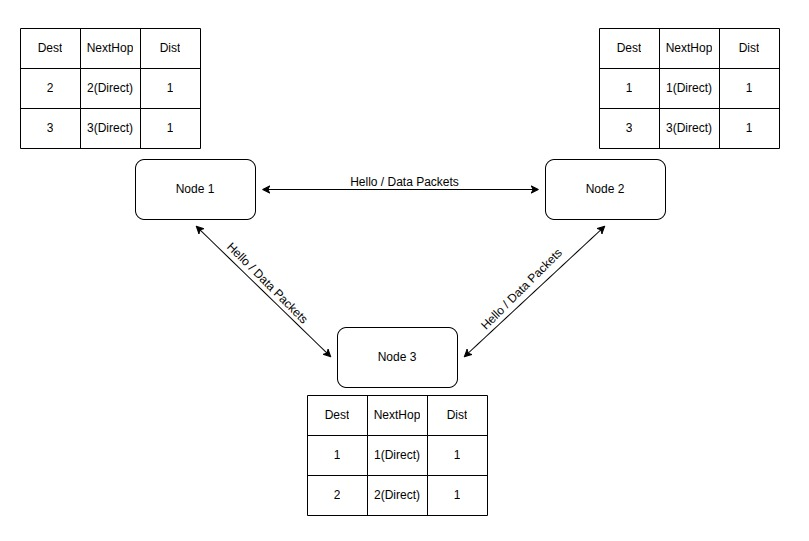
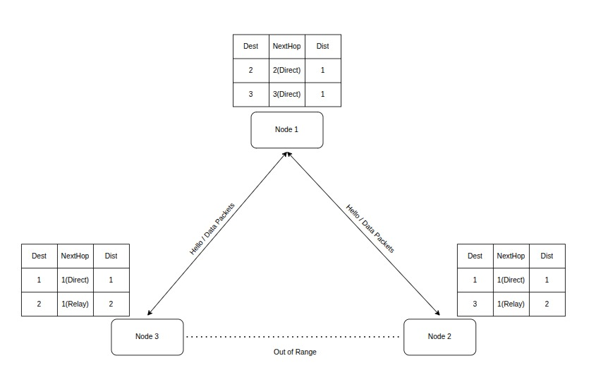
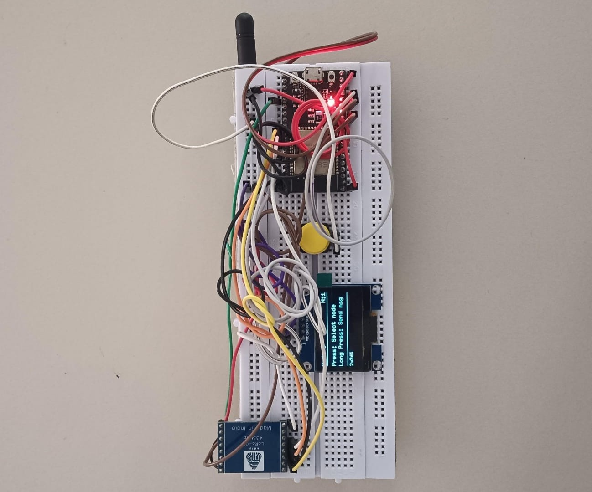
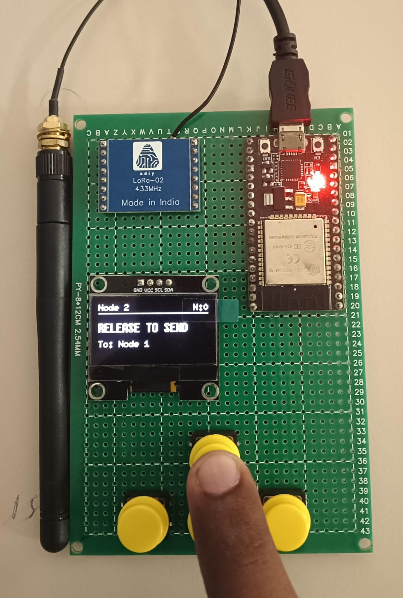
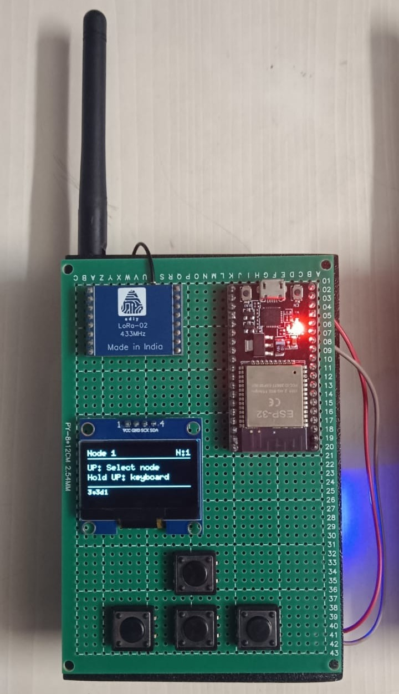
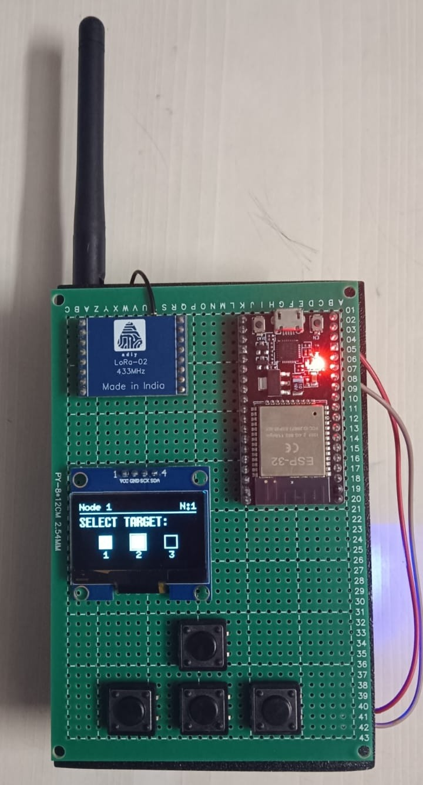
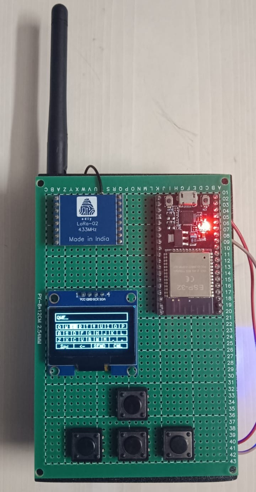
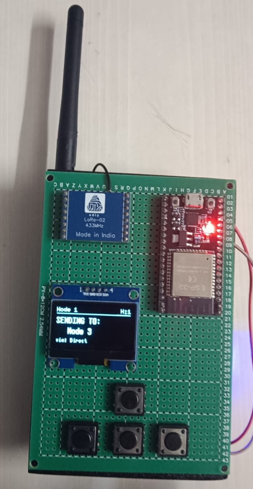
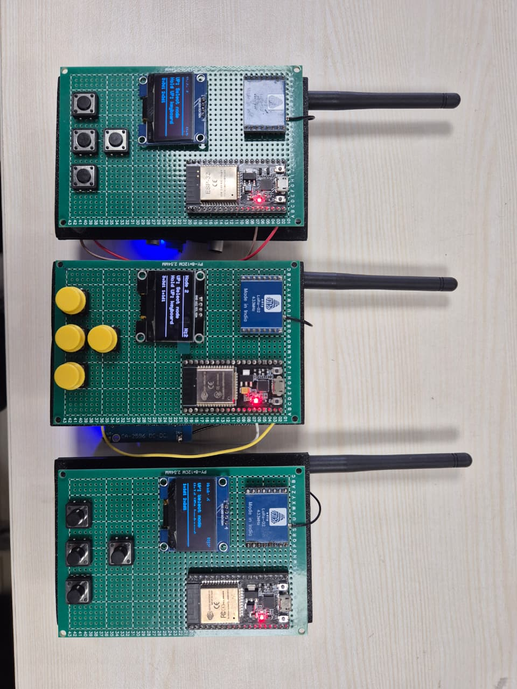
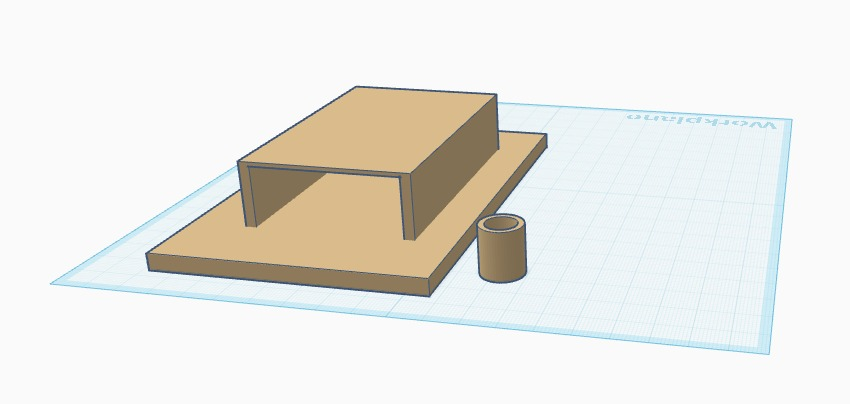

# LoRa Mesh Network with AES-GCM Encryption

A multi-node LoRa mesh network built on the ESP32 platform, implementing distance-vector routing, AES-128-GCM authenticated encryption, and a real-time OLED interface. Designed for secure, low-power, long-range wireless communication without infrastructure dependency.

---

## Table of Contents

- [Overview](#overview)
- [Hardware Requirements](#hardware-requirements)
- [Software Dependencies](#software-dependencies)
- [System Architecture](#system-architecture)
- [Packet Structure](#packet-structure)
- [Routing Protocol](#routing-protocol)
- [Encryption](#encryption)
- [Node Configuration](#node-configuration)
- [Flashing Instructions](#flashing-instructions)
- [Network Diagrams](#network-diagrams)
- [Results](#results)
- [Known Limitations](#known-limitations)

---

## Overview

This project implements a three-node LoRa mesh network where each node is capable of sending, receiving, and relaying encrypted messages. The network uses a custom distance-vector routing protocol to dynamically discover and maintain routes between nodes. All transmissions are encrypted using AES-128 in Galois/Counter Mode (GCM), providing both confidentiality and message authentication.

Key features:

- AES-128-GCM hardware-accelerated encryption via mbedTLS on the ESP32
- Distance-vector routing with split-horizon and implicit route withdrawal
- Dual-core FreeRTOS architecture: Core 0 handles LoRa reception, Core 1 handles UI and transmission
- On-screen keyboard on a 128x64 OLED for composing and sending messages without a host computer
- Automatic route expiration and topology recovery

---

## Hardware Requirements

Each node requires the following components:

| Component | Specification |
|---|---|
| Microcontroller | ESP32 (dual-core, 240 MHz) |
| LoRa Module | SX1276 or compatible, operating at 433 MHz |
| Display | 128x64 OLED (SH1106 or SSD1306, I2C) |
| Navigation | 4 tactile push buttons (UP, DOWN, LEFT, RIGHT) |
| Power | USB or LiPo battery with appropriate regulator |

Default pin assignments:

| Signal | GPIO |
|---|---|
| LoRa RST | 14 |
| LoRa DIO0 | 2 |
| LoRa SS | Default SPI CS |
| OLED SDA | 21 |
| OLED SCL | 22 |
| Button UP | 13 |
| Button DOWN | 26 |
| Button LEFT | 25 |
| Button RIGHT | 27 |

---

## Software Dependencies

Install the following libraries via the Arduino Library Manager or PlatformIO:

- LoRa by Sandeep Mistry
- U8g2 by Oliver Kraus
- mbedTLS (bundled with the ESP32 Arduino core, no separate install required)

---

## System Architecture

The firmware runs two concurrent FreeRTOS tasks pinned to separate cores:

- Core 0 runs the receiver task, which polls for incoming LoRa packets, decrypts them, updates the routing table, and queues messages for display or relay.
- Core 1 runs the main loop, which handles button input, OLED rendering, periodic HELLO broadcasts, relay forwarding, and route expiration.

A mutex protects LoRa SPI access and a separate mutex protects the routing table. Two FreeRTOS queues decouple reception from display and relay processing.

---

## Packet Structure

### Plain Packet Before Encryption

All fields are assembled as a pipe-delimited ASCII string before encryption.

| Field | Value | Byte | Size (Bytes) |
|---|---|---|---|
| Type | D | Byte 0 | 1 |
| Delimiter | \| | Byte 1 | 1 |
| Source (SRC) | 01 | Byte 2-3 | 2 |
| Delimiter | \| | Byte 4 | 1 |
| Destination (DST) | 02 | Byte 5-6 | 2 |
| Delimiter | \| | Byte 7 | 1 |
| NEXT_HOP | 02 | Byte 8-9 | 2 |
| Delimiter | \| | Byte 10 | 1 |
| Payload | "this is board 1" | Byte 11-25 | 15 |
| **Total Size (Bytes)** | | | **26** |

Table 1. Plain Packet Structure before Encryption

### Encrypted Packet Transmitted over LoRa

The encrypted packet prepends a 12-byte random IV (nonce) and appends a 16-byte GCM authentication tag to the ciphertext.

| Component | Byte Range | Size (Bytes) |
|---|---|---|
| Initialization Vector (IV) | Bytes 0-11 | 12 |
| Encrypted Payload (Cipher Text) | Bytes 12-43 | 32 |
| GCM Authentication Tag | Bytes 44-59 | 16 |
| **Total Size (Bytes)** | | **60** |

Table 2. Encrypted Packet Structure Transmitted over LoRa

Note: Actual total size scales with payload length. The values above reflect the example 26-byte plain packet.

### Encryption and Decryption Performance Comparison

Performance was measured over 1000 operations on the ESP32 at 240 MHz.

| Operation | Implementation | Total Time (us) | Average Time per Operation (us) |
|---|---|---|---|
| Encryption | Hardware (mbedTLS) | 8176 | 8.18 |
| Encryption | Software (tiny-AES-c) | 28669 | 28.67 |
| Decryption | Hardware (mbedTLS) | 8119 | 8.12 |
| Decryption | Software (tiny-AES-c) | 52171 | 52.17 |

Table 3. Encrypted and Decryption Comparison

Hardware-accelerated AES via mbedTLS is approximately 3.5x faster for encryption and 6.4x faster for decryption compared to the software-only tiny-AES-c implementation.

---

## Routing Protocol

The network uses a simplified distance-vector protocol inspired by RIP. Each node broadcasts a HELLO packet every 2 seconds containing its known direct neighbors and their distances.

Route selection follows these rules:

- A route is added when a new destination is discovered via a neighbor's HELLO.
- A route is updated only if the new path offers a shorter distance, or if the update comes from the same next-hop node (to refresh the timeout).
- Split-horizon is enforced: nodes only advertise routes with distance 1 (direct neighbors) in their HELLO packets, preventing count-to-infinity.
- Implicit route withdrawal: when a HELLO is received from node X, any route through X that X no longer advertises is immediately removed.
- Route expiration: any route not refreshed within 15 seconds is removed from the routing table.
- Maximum hop count is 3, preventing routing loops in larger topologies.

### HELLO Packet Format

```
H|<SRC>|0|0|<nodeId>:<dist>,<nodeId>:<dist>,...
```

### Data Packet Format

```
D|<SRC>|<DST>|<NEXT_HOP>|<payload>
```

---

## Encryption

All packets, including HELLO broadcasts, are encrypted with AES-128-GCM before transmission. The implementation uses the mbedTLS library bundled with the ESP32 Arduino core, which leverages the ESP32 hardware AES accelerator.

Each transmission uses a fresh 12-byte random IV generated using `esp_random()`. The 16-byte GCM authentication tag is appended to the ciphertext. On reception, the tag is verified before the packet is processed. Packets with invalid tags are silently rejected, providing protection against replay attacks and packet forgery.

The shared 128-bit key must be identical on all nodes and is defined in the source file.

Change this key before deployment. All nodes in the network must share the same key.

---

## Node Configuration

Before flashing, set the node identifier at the top of the source file:

```c
#define NODE_ID 1   // Change to 1, 2, or 3 for each board
```

Other configurable parameters:

| Parameter | Default | Description |
|---|---|---|
| MAX_NODES | 5 | Maximum entries in the routing table |
| HELLO_INTERVAL | 2000 ms | Frequency of HELLO broadcasts |
| ROUTE_TIMEOUT | 15000 ms | Time before an unrefreshed route is removed |
| MAX_HOPS | 3 | Maximum allowed hop count |
| DISPLAY_TIMEOUT | 3000 ms | Duration before display returns to idle |
| LORA_FREQUENCY | 433 MHz | Operating frequency (change for your region) |

---

## Flashing Instructions

1. Install the Arduino IDE and add ESP32 board support via the Boards Manager URL: `https://raw.githubusercontent.com/espressif/arduino-esp32/gh-pages/package_esp32_index.json`
2. Install the required libraries listed above.
3. Open `src/lora_mesh_node/lora_mesh_node.ino`.
4. Set `NODE_ID` to the correct value for the board being flashed.
5. Select the correct board (ESP32 Dev Module or equivalent) and port.
6. Click Upload.
7. Repeat for each node with its corresponding NODE_ID.

---

## Network Diagrams

### Figure 1. Node Topology and Routing State (Direct Range Access)

All three nodes are within direct radio range of each other. Each node discovers its neighbors through HELLO broadcasts and maintains direct routes with distance 1.



*Caption: [In the direct-range scenario, every node can communicate with every other node without relaying. The routing tables reflect distance 1 (direct) for all destinations.]*

---

### Figure 2. Node Topology and Routing State (With Relay via Node 1)

Node 2 and Node 3 are out of direct radio range of each other. Node 1 is in range of both and acts as a relay. Node 2 and Node 3 discover each other through Node 1's HELLO advertisements.



*Caption: [In this topology, a message from Node 3 to Node 2 is forwarded by Node 1. The routing tables on Node 2 and Node 3 correctly reflect the relay path with distance 2 and next-hop pointing to Node 1. Node 1 maintains distance 1 direct routes to both.]*

---

## Results

The following results were captured during physical testing of the three-node network.

### Result 1



*[Breadboard Version of a node in the network]*

---

### Result 2



*[Universal PCB without battery connection]*

---

### Result 3



*[A independent node in the mesh network]*

---

### Result 4



*[Selecting the target node]*

---

### Result 5



*[Custom Input to the device]*

---

### Result 6



*[Sending the message to the target node]*

---

### Result 7



*[All 3 nodes in the network together]*

---

### Result 8



*[Custom 3D Case]*


## Known Limitations

- The shared AES key is stored in plaintext in the source file. For production use, consider storing it in NVS (Non-Volatile Storage) with appropriate access controls.
- The routing protocol uses a simplified distance-vector approach without full Bellman-Ford convergence guarantees. It is suitable for small networks of up to 5 nodes.
- The on-screen keyboard is limited to 24 characters per message.
- LoRa operates in a half-duplex mode. Simultaneous transmissions from multiple nodes may cause packet collisions. A random anti-collision jitter (150-250 ms) is applied on relay to reduce collision probability but does not eliminate it.
- The network has been tested with three nodes. Behavior with more than three nodes is functional but has not been fully characterized.

---

## License

This project is released for academic and educational use. Refer to the LICENSE file for details.
